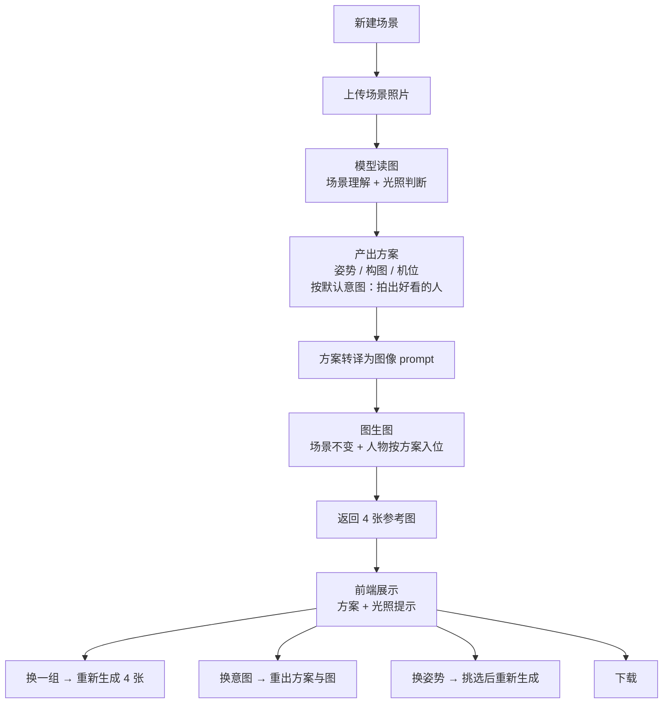

# 拍摄参考生成 Agent

> 上传一张场景照片，拿到一组姿势与构图参考——人站哪、怎么摆、机位架在哪。

**仓库名**：`boyfriend-savior-from-bad-shots`
**形态**：前端 H5 + 后端 TypeScript
**当前状态**：设计阶段，尚无代码实现（图生图可行性已做过实验验证）

---

## 一、这是什么

一个帮拍照的人"提前看到成片"的 Agent。

用户上传一张场景照片（空场地、房间、街角、海边都行），系统读图后给出一套**姿势与构图方案**——人物站哪、身体怎么摆、机位架在哪、用什么景别——再依据这套方案用图生图生成一组参考照片：**场景大体不变，但人物已经按方案站好、机位已经按方案架好**。

它要解决的核心问题很具体：**大多数人不是审美不行，是不知道这一刻该让人怎么摆、自己该往哪站。** 参考图不是拿来发朋友圈的，是给现实中的**拍照者**和**模特**看的——拍照者知道该站在哪、举多高；模特知道该站哪、朝哪边。把"你往左一点""自然一点"这种说不清的口头指令，换成一张一眼就懂的图。

几条贯穿全局的约定：

- **永远返回参考图**，不做"这个场景不适合拍"的拒答。光照条件不好时，附一条提示说明情况。
- **意图默认是"拍出好看的人"**，第一轮直接按它出图；想要别的效果，出图之后再切。
- **上传的图和生成的图都不长期落盘，带真人的成片永远不会经过这个工具**（见第十一节）。

---

## 二、要解决的问题

| 现状 | 后果 |
| --- | --- |
| 不知道该让模特摆什么姿势 | 站桩式合影，每张都一样 |
| 拍照的人不知道该站哪、手机举多高 | 现场反复试错，模特越等越烦 |
| "往左一点""自然一点"无法传达 | 沟通成本极高，且每次都要重新沟通 |
| 同一个场景，别人能拍出大片，自己拍出来很平 | 缺的不是审美，是可执行的姿势与构图方案 |
| 拍了才发现构图、光线有问题 | 只能事后补救 |

核心判断：**拍照的人不是不想拍好，而是不知道此刻该怎么拍。**

---

## 三、端到端流程（v0.1）

一个**场景（Scene）= 一轮对话**。在这一轮里发生的所有事情——上传的原图、分析结论、生成的每一组图、用户的每一次"换一组""换意图"——都属于这一轮，作为一个整体保存。

---

## 四、光照：只做判断，不做精细指挥

### 为什么这一块要刻意做浅

两个事实叠在一起：

1. **现场光基本不可控。** 拍照的人手上只有一部手机，唯一的补光手段是闪光灯——没有反光板、没有补光灯，也不会有助理举着灯。
2. **模型判读光位并不准。** 主光从哪个方向来、是硬光还是软光、有没有可用的阴影区——让它看一眼照片就说准，是很高的要求，而它确实容易答错。

把这两个事实放在一起，结论很清楚：**给一条可能是错的精细指令，比不给指令更糟。** 用户如果照着"往左挪两米"走过去，结果光更差了，他不会觉得是模型判错了，只会觉得这工具没用。

所以光照只输出两件事：

| 输出 | 形态 |
| --- | --- |
| **判断** | 当前光照对拍人像是否合适（一句话结论） |
| **建议** | 是否需要用户自行寻找更好的光照条件（是 / 否，必要时补一句往哪个方向找） |

### 明确不做的

- 不分析主光方位、高度角、硬软光、色温
- 不输出"开闪光灯 / 移到阴影 / 面朝某个角度"这类具体动作指令
- 不因为光照不理想而不出图

**光照不理想也照样出图。** 用户上传的照片，往往就是他此刻站着的地方；告诉他"这里拍不了"是句废话。照样给方案、照样出图，然后把光照判断和建议附在下面，剩下的交给他自己判断。

### 参考图的角色也跟着变了

既然不做精细的光照指挥，图生图也就不必去刻意模拟某种打光效果。参考图要传达的是**姿势、构图和机位**——光只要别离谱到让人无法参考就行。

---

## 五、拍摄意图：默认一个，出图后再换

### 默认意图：拍出好看的人

第一轮不做提问，直接按"拍出好看的人"出图。理由很实际：**用户最初的诉求就是"我站这儿了，快告诉我怎么拍"**，在这个节点上先弹一个问题，等于把最想立刻拿到的东西推后了一步。

### 出图之后，把其他几种意图摆出来

同一张场景照，意图不同，方案完全不同：

| 意图 | 典型场景 | 方案该偏向什么 |
| --- | --- | --- |
| **人物好看（默认）** | 都可能有 | 人占画面主体、脸部清晰、背景虚化 |
| 生活方式 / 身份展示 | 商店、餐厅、酒店 | 环境与品牌元素必须入画，人物和场景并重，消费痕迹（购物袋、餐桌、房卡）成为画面的一部分 |
| 商品 / 场地推广 | 店铺、展览 | 商品清晰完整、构图给商品留位、人物退为陪衬甚至不出镜 |
| 打卡 / 环境为主 | 景点、地标 | 地标完整入画、用人物做尺度参照、走广角 |
| 脸部特写 | 景点、室内 | 近景为主，对光照的要求最苛刻 |

在商店里，是拍一张好看的人像，还是拍"我们来这儿消费了"的样子，还是替店家拍商品？在景点，是人物特写、脸部特写，还是景点本身为主？

**这些答案不在场景图里**——模型能看出这是哪家店、哪个景点，看不出你想要什么。所以处理方式是：先按默认意图出图，同时把**模型认为这个场景下说得通的另外几种意图**作为选项列出来（商店给"生活方式 / 商品推广"，景点给"脸部特写 / 环境为主"），用户点一下就能重出。

候选清单由模型按场景现场推断，不是写死的固定菜单。

### 换了意图会怎样

重出方案 + 重出一组图。原来的那组保留在这一轮的记录里，可以点回去看。

---

## 六、为什么这是 Agent，而不是 Workflow

这一节的判断决定了整个架构，所以单独写清楚。

**Workflow 的假设**：输入进来，固定步骤 A→B→C 走完，输出出去。每一步的输入输出在写代码时就定死了。

**本项目的实际形态**：

1. **每一步产出什么内容，是模型现场判断的，不是模板填空。**
   光照行不行、这个场景下还有哪几种意图说得通、姿势怎么摆、机位架多高——这些都要模型看过这张图之后当场得出。尤其**姿势与构图方案是本产品的核心产出**，它没有任何可套的模板：同一个咖啡店，窗边和吧台是两套完全不同的摆法。这部分只能靠模型的判断力。

2. **后续动作由用户指令驱动，而非固定流。**
   出图之后用户可以做"换一组""换个意图""换个姿势""下载"——这些是新的指令，不是流程里的下一步。同一个场景可以有任意多轮，走哪条路取决于用户当轮说了什么。

3. **每一步的输出是下一步的输入，中间没有人工写死的胶水。**
   方案直接决定图生图的 prompt；用户切换意图会重新触发方案生成；选定姿势后重新进入生成环节。

因此架构上采用**「一个场景 = 一个会话（session）」**的模型：后端持有这一轮的上下文，前端只是这个会话的视图。

> **边界在哪，值得写下来。**
>
> 主干是一条直线：上传 → 分析 → 出图。模型不决定流程往哪走，它决定的是**每一步产出什么内容**——光照判断的结论、候选意图的清单、姿势与构图的方案，全部现场生成。加上"一个场景 = 多轮会话、后续动作由用户指令驱动"，这两条合起来才撑得住 Agent 这个定位。
>
> 反过来说：如果哪天把它做成"上传 → 查表 → 套模板出图"，或者让"换一组""换姿势""换意图"变成三个各打固定接口、中间没有任何判断的按钮，它就退化成一个带会话状态的 Workflow 了。之所以要把这条写进文档，是因为**它很容易在迭代中被一点点磨掉**——每次为了"稳定"和"快"而砍掉一点模型判断，最后就什么都不剩了。

---

## 七、前端（H5）

### v0.1 范围

**一个简易的文件上传与展示界面**。不放任何多余功能。

初始状态为空：只有一个"新建场景"入口。新建之后进入该场景的会话页面，此时**页面上只有上传功能**，没有别的按钮。

| 阶段 | 界面元素 |
| --- | --- |
| 空状态 | 新建场景 |
| 已新建，待上传 | 文件选择 / 拖拽上传 |
| 分析中 | 进度提示（读场景 → 出方案） |
| 生成中 | 方案文本 + 光照提示 + 生成进度 |
| 已出图 | 4 张参考图（2×2）+ 方案 + 光照提示 |
| 出图后操作 | 换一组 / 换意图 / 换姿势 / 下载 |
| 历史 | 场景列表，可回到任意一轮 |

### 交互约定

- **一次生成 4 张**，作为一个"组"展示在 2×2 网格里。
- **换一组** = 丢弃当前这组，重新生成 4 张。
- **换意图** = 从模型给出的候选意图里选一个（含"都不对，我来说"），重出方案与一组图。
- **换姿势** = 展开可选的姿势方案，挑一个后按该姿势重新生成。
- **光照提示** = 固定在方案与参考图下方，只给"当前光照是否合适"和"是否需要自行寻找更好的光照"两句。它不是错误提示，不阻断任何操作。
- **下载** = 把参考图存到本地。

---

## 八、后端（TypeScript）

### 职责

1. 接收上传的场景图，落临时存储
2. 调多模态模型做场景理解、光照判断与姿势/构图方案分析
3. 把结构化方案转译成图像模型的 prompt
4. 调图像模型做图生图（一组 4 张，并发）
5. 把结果回传前端，并把这一轮的记录交给客户端保存
6. **全程不落盘**：图片只在处理期间持有，会话结束即清；日志、异常上报、埋点里不带图、不带可回溯的图片 URL

### 接口草案

| 方法 | 路径 | 说明 |
| --- | --- | --- |
| `POST` | `/api/scenes` | 新建场景，返回 `sceneId` |
| `POST` | `/api/scenes/:id/upload` | 上传场景图，按默认意图触发分析与出图，流式返回进度与结果 |
| `POST` | `/api/scenes/:id/intent` | 换意图，重出方案与一组图 |
| `POST` | `/api/scenes/:id/regenerate` | 换一组，重新生成 4 张 |
| `POST` | `/api/scenes/:id/poses` | 取可选姿势列表 |
| `POST` | `/api/scenes/:id/poses/:poseId` | 按选定姿势重新生成 |
| `GET` | `/api/scenes/:id` | 取该轮的完整状态（用于恢复） |

分析和生成这两步都耗时明显长于普通请求（几十秒级）。建议上传与生成两个接口都走 **SSE**（Server-Sent Events：服务器保持一个长连接，持续往浏览器单向推送事件）返回，而不是一个长时间的阻塞请求。阻塞请求有两个问题：一是容易撞上 HTTP 超时，二是用户对着转圈的界面干等，分不清是卡住了还是在正常处理——SSE 可以持续推"正在读场景""正在生成第 2/4 张"这类进度。

---

## 九、模型选型

两个环节都走**豆包**，统一经 **DMXAPI** 中转调用，不直连火山引擎方舟。好处是鉴权、计费、限流收拢到一个 Key，后端调用层只有一套协议——DMXAPI 是 OpenAI 兼容的，用官方 `openai` SDK 改个 `baseURL` 就能接。

### 1. 场景理解 + 方案生成 —— 豆包多模态理解

用 `doubao-seed` 系列的视觉理解模型。这一环要产出三类东西：

| 产出 | 内容 |
| --- | --- |
| 拍摄方案（核心） | 姿势、构图、机位高度、景别、人物朝向 |
| 光照判断 | 是否合适 + 是否需要用户自行寻找更好的光照（见第四节） |
| 候选意图 | 这个场景下另外哪几种意图说得通（见第五节） |

用 JSON schema 约束成结构化字段，不要让它自由发挥成一段散文。好处有两个：前端可以直接渲染成清单，图生图那一步也能拿到稳定字段去拼 prompt。

### 2. 图生图 —— 豆包 Seedream / SeedEdit

走 DMXAPI 的 `/images/edits`（图像编辑）接口，用 `doubao-seededit` 系列模型，把原场景图作为底图，prompt 描述人物姿势与机位的变化。

**可行性已做过实验验证**：场景保真度能达到"大差不差、一眼认得出是同一个地方"的程度，满足参考用途。因此**保真度不作为主要风险**，prompt 的重心放在把姿势和构图表达清楚上，不必在场景保持上过度设计。

### 接入信息

| 项 | 值 |
| --- | --- |
| Base URL | `https://www.dmxapi.cn`（国内站，人民币计价） `https://www.dmxapi.com`（国际站，美元计价） |
| 图片理解 | `/chat/completions` |
| 图生图 | `/images/edits` |
| 文生图 | `/images/generations` |
| 鉴权 | DMXAPI 令牌 |
| 后端 SDK | 官方 `openai` SDK，改 `baseURL` 即可 |

三个坑，接的时候注意：

1. **令牌必须和域名配套**——国内站的令牌配 `.cn`，国际站的配 `.com`，混用会直接失败。
2. **`/v1` 加不加，取决于调用方式，别凭猜。** 记录的服务地址是 `https://www.dmxapi.cn`（不带 `/v1`）。但 OpenAI 官方 SDK 的 `baseURL` 是自己往后面拼 `/chat/completions` 的，这种用法一般要写成 `https://www.dmxapi.cn/v1`，否则请求会打到 `https://www.dmxapi.cn/chat/completions` 上，拿到 404；而另外一些工具（如 Claude Code）只认域名，加上 `/v1` 反而不通。**接入时先用一个最小请求跑通，再写进代码**，这类 404 基本都是这个原因。
3. **模型名以 DMXAPI 的模型列表为准**。豆包模型在 DMXAPI 上的名称不一定和火山方舟原厂的 ID 完全一致（原厂形如 `doubao-seededit-3-0-i2i-250628`、`doubao-seed-2-1-pro-260628`，带日期后缀），**不要照抄这里的示例**，以平台实际列出的为准。

---

## 十、主要风险与待确认

按重要性排序。

1. **姿势与构图方案的质量，就是产品的天花板。**
   这是核心产出，也是最没有模板可套的一环——同一个场景，好的方案和坏的方案差别巨大，而"好"很难自动判定。需要尽早建立一套人工评估：找一批真实场景图，让人给方案打分，看模型是稳定在"能用"还是忽好忽坏。**这一条决定了产品到底是"神器"还是"看起来能用"**，优先级高于其他所有事项。

2. **候选意图的覆盖度，和"换意图"的成本。**
   默认出图意味着第一次的意图可能是错的——用户想要的是"我在这儿消费了"的感觉，拿到的却是好看的人像。这时候候选清单里有没有他要的那个，就决定了要不要重来一次。三件事要定：模型推断的候选意图命中率有多高？"都不对，我来说"这个出口的转化率如何？换一次意图要重跑方案加一组图，成本能不能接受？

3. **光照判断的准确率。**
   虽然已经刻意做浅了（只给"合不合适"和"要不要另找光"），但正因为只有两句话，**答错的代价反而集中**——说"合适"结果不合适，用户到现场才发现。需要摸清：模型对"光照是否适合拍人像"这个二元判断的准确率到底有多少？如果太低，就要考虑把它降级成更模糊的措辞，或者干脆只提示"请自行确认光线"。

   另外要留心：**没有拦截意味着截图、商品图、纯文字图也会走完全程并出图**，这类产出必然是垃圾。是接受这个结果，还是对明显不合理的输入做一次轻量兜底（"这似乎不是一张场景照，仍可继续"），需要定。

4. **成本与延迟。**
   每一轮 = 1 次视觉分析 + 4 次图像生成。"换一组""换意图"各再乘一次。需要尽早测出单轮成本和端到端耗时，这直接决定产品能不能成立。

5. **单图还是多图。**
   当前设计是上传一张。如果用户想交代"人站这边、我在那边拍"，可能需要多图输入。

6. **本地存储的容量。**
   4 张图 × 多轮，浏览器存储配额会吃紧。需要在 v0.1 就定好图片压缩策略和淘汰策略。

---

## 十一、数据、隐私与本地存储

### 隐私是产品定义，不是合规补充

这个工具处理的是**场景照**，产出的是**参考图**——从头到尾没有一张真人照片进入链路。用户拿着参考图，用自己的相机或别的 app 去实拍，**最后那张带女朋友的照片永远不会经过这个工具。**

这条决定了架构，不只是措辞：

| 约束 | 落地要求 |
| --- | --- |
| 上传图与生成图都不长期落盘 | 后端只在处理期间持有，会话结束即清除；临时文件要有明确的 TTL 和清理时机 |
| 不建服务端账号体系 | 没有"我的作品集"这类服务端资产，历史只存在用户设备上 |
| 日志与监控不带图 | 日志、异常上报、埋点里不能出现图片内容，也不能出现可回溯的图片 URL |
| 第三方中转要查清 | 调用经 DMXAPI 中转，**对方是否留存调用数据需要自行确认**——公开资料里的"不存储客户调用数据"属于宣传口径，不能直接当成承诺写进产品文档 |

> 注意"不长期落盘"不等于"不存"：本地历史是有意保留的，区别在于**存在用户自己的设备上、且用户能自己删**，而不是存在服务端。

### 本地存储

**每一轮对话和生成的图片，保存在客户端本地。**

- **v0.1**：实现 Windows 端（桌面浏览器），用 IndexedDB 存原图、方案与生成图。
- **v0.2**：补 Android 与 iOS。存储层从一开始就做成抽象接口，v0.1 只提供浏览器实现，移动端后续接入各自的文件系统实现，**业务代码不改**。

这样设计的代价是：换一组、换姿势、换意图时需要重新走一遍后端，因为服务端不留图。后端只做临时缓存，不作为数据源。

---

## 十二、版本规划

**v0.1**
- [ ] H5：新建场景 → 上传 → 展示 → 下载
- [ ] 后端 TS：分析接口 + 图生图接口
- [ ] 姿势与构图方案的结构化输出
- [ ] 光照判断与提示
- [ ] 默认意图出图 + 换意图
- [ ] 一次生成 4 张 / 换一组
- [ ] 多姿势挑选
- [ ] 服务端不落盘：临时文件 TTL 与清理时机
- [ ] 本地历史（Windows）

**v0.2**
- [ ] 本地历史补齐 Android / iOS
- [ ] 依据实拍结果反馈调优方案

---

## 十三、术语

| 术语 | 含义 |
| --- | --- |
| 场景 Scene | 一轮对话的载体，包含原图、方案、生成结果与后续操作 |
| 拍摄方案 | 核心产出：姿势、构图、机位、景别、人物朝向 |
| 拍摄意图 | 这组照片是为什么拍的（人物好看 / 生活方式 / 商品推广 / 打卡 / 特写），决定方案的偏向 |
| 默认意图 | 拍出好看的人。第一轮直接按它出图，不提问 |
| 光照提示 | 附在方案与参考图下方的两句话：光照是否合适 + 是否需要自行寻找更好的光照 |
| 参考图 | 图生图产出的 AI 人像图，用途是给真人拍摄做参考 |
| 一组 | 一次生成的 4 张参考图 |
| 不落盘 | 上传图与生成图在服务端只于处理期间存在，不进持久化存储、不进日志 |

---

## 十四、仓库状态

目前仓库内只有这份 README，没有代码。

已完成的前置验证：

- ✅ **图生图保真度**——豆包可以做到"大差不差"，满足参考用途，不作为风险项。

还需要做的实验，都不需要写完整产品：

1. **姿势与构图方案的质量评估**（优先级最高）——拿一批真实场景图，让模型出方案，人工打分。看它是稳定能用，还是忽好忽坏。这一条决定产品成不成立。
2. **意图推断实验**——看模型推断出的候选意图是否合理、命中率有多高，以及"都不对，我来说"的使用率。
3. **光照判断准确率实验**——拿不同光照条件的图（顺光、侧光、逆光、顶光、室内混合光），看那个二元判断的准确率，决定要不要进一步弱化措辞。
