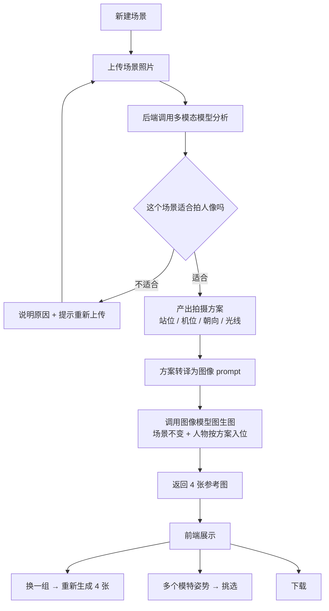

# 拍摄参考生成 Agent

> 上传一张场景照片，得到一组"人应该站在哪、机位应该架在哪"的参考图。

**仓库名**：`boyfriend-savior-from-bad-shots`
**形态**：前端 H5 + 后端 TypeScript
**当前状态**：设计阶段，尚无代码实现

---

## 一、这是什么

一个帮拍照的人"提前看到成片"的 Agent。

用户上传一张场景照片（空场地、房间、街角、海边都行），系统先判断这个场景**是否适合拍人像**；如果适合，输出一套具体的拍摄方案——人物站位、机位高度、朝向、光线处理——再依据这套方案用图生图生成一组参考照片：**场景大体不变，但人物已经按方案站好、机位已经按方案架好**。

参考图不是拿来发朋友圈的，是给现实中的**拍照者**和**模特**看的：拍照者知道该站在哪、举多高；模特知道该站在哪、朝哪边。把"你往左一点"这种说不清的口头指令，换成一张一眼就懂的图。

---

## 二、要解决的问题

| 现状 | 后果 |
| --- | --- |
| 拍照的人不知道该站哪、手机举多高 | 现场反复试错，模特越等越烦 |
| "往左一点""自然一点"无法传达 | 沟通成本极高，且每次都要重新沟通 |
| 同一个场景，别人能拍出大片，自己拍出来很平 | 缺的不是审美，是可执行的机位方案 |
| 拍了才发现构图、光线有问题 | 只能事后补救 |

核心判断：**拍照的人不是不想拍好，而是不知道此刻该怎么拍。**

---

## 三、端到端流程（v0.1）

一个**场景（Scene）= 一轮对话**。在这一轮里发生的所有事情——上传的原图、分析结论、生成的每一组图、用户的每一次"换一组"——都属于这一轮，作为一个整体保存。

---

## 四、为什么这是 Agent，而不是 Workflow

这一节的判断决定了整个架构，所以单独写清楚。

**Workflow 的假设**：输入进来，固定步骤 A→B→C 走完，输出出去。所有分支和重试在写代码时就穷举完了。

**本项目的实际形态**：

1. **入口处就有一个由模型做出的判断。**
   上传的图不一定能拍人像——可能是截图、商品图、纯文字、过于杂乱的空间。系统不会无脑往下走，而是先判断"这个场景适不适合拍人像"，不适合就停下来并说明原因。这个分支不是 `if (imageWidth > 800)` 能表达的，只能由模型看过图之后决定。

2. **后续动作由用户意图驱动，而非固定流。**
   出图之后用户可以做"换一组""换个姿势看看""下载"——这些是新的指令，不是流程里的下一步。同一个场景可以有任意多轮，走哪条分支取决于用户当轮说了什么。

3. **每一步的输出是下一步的输入，中间没有人工写死的胶水。**
   分析结论直接决定图生图的 prompt；用户对姿势的选择会重新进入生成环节。

因此架构上采用**「一个场景 = 一个会话（session）」**的模型：后端持有这一轮的上下文，模型在其中决定是否继续、调用哪个工具、调用几次。前端只是这个会话的视图。

---

## 五、前端（H5）

### v0.1 范围

**一个简易的文件上传与展示界面**。不放任何多余功能。

初始状态为空：只有一个"新建场景"入口。新建之后进入该场景的会话页面，此时**页面上只有上传功能**，没有别的按钮。

| 阶段 | 界面元素 |
| --- | --- |
| 空状态 | 新建场景 |
| 已新建，待上传 | 文件选择 / 拖拽上传 |
| 分析中 | 进度提示（判断场景 → 产出方案） |
| 不适合拍摄 | 原因说明 + 重新上传 |
| 分析完成，生成中 | 拍摄方案文本 + 生成进度 |
| 已出图 | 4 张参考图（2×2）+ 换一组 / 换姿势 / 下载 |
| 历史 | 场景列表，可回到任意一轮 |

### 交互约定

- **一次生成 4 张**，作为一个"组"展示在 2×2 网格里。
- **换一组** = 丢弃当前这组，重新生成 4 张。
- **多个模特姿势** = 展开可选的姿势方案，挑一个后按该姿势重新生成。
- **下载** = 把参考图存到本地。

---

## 六、后端（TypeScript）

### 职责

1. 接收上传的场景图，落临时存储
2. 调多模态模型做场景判断与拍摄方案分析
3. 把结构化方案转译成图像模型的 prompt
4. 调图像模型做图生图（一组 4 张，并发）
5. 把结果回传前端，并把这一轮的记录交给客户端保存

### 接口草案

| 方法 | 路径 | 说明 |
| --- | --- | --- |
| `POST` | `/api/scenes` | 新建场景，返回 `sceneId` |
| `POST` | `/api/scenes/:id/upload` | 上传场景图，触发分析，流式返回进度与结论 |
| `POST` | `/api/scenes/:id/regenerate` | 换一组，重新生成 4 张 |
| `POST` | `/api/scenes/:id/poses` | 取可选姿势列表 |
| `POST` | `/api/scenes/:id/poses/:poseId` | 按选定姿势重新生成 |
| `GET` | `/api/scenes/:id` | 取该轮的完整状态（用于恢复） |

分析步骤耗时明显长于普通请求，进度需要实时可见，建议上传与生成两个接口都走流式（SSE）返回，而不是一个长时间的阻塞请求。

---

## 七、模型选型

分成两个完全不同的环节，用的是两类模型。

### 1. 场景判断 + 拍摄方案分析 —— Claude

推荐 `claude-opus-5-5`。这一环要同时做三件事：读图理解空间关系、判断"能不能拍"、产出摄影师能照着执行的具体参数（站位、机位高度、朝向、焦段、光线处理）。属于需要视觉理解加长链推理的任务。

产出建议用结构化输出（`output_config.format`）固定成 schema，好处有两个：前端可以直接渲染成表单/清单，图生图那一步也能拿到稳定字段而不是一段散文。

### 2. 图生图 —— 第三方图像 API

**Anthropic 的 API 不提供图像生成能力**，Claude 多模态是"能读图"，不是"能出图"。所以这一环必须用外部图像生成/编辑接口（Google、OpenAI 等平台的图像生成与图像编辑能力）。

这一环是整个项目技术风险最高的地方，见下节。

---

## 八、主要风险与待确认

按重要性排序，前两条不解决就没法开工。

1. **"场景大体不变"能保持到什么程度？**
   第三方图像 API 做图生图时，保留原图的透视、物体位置、光照是一项独立难题。可能出现墙歪了、家具位移、窗外景色换掉。需要先做实验明确：纯 prompt 能否达到"拍照者一眼能认出这是同一个地方"的程度；如果不行，是否需要引入分割/深度辅助（先确定人物应该占的像素区域，再交给图像模型）。

2. **"适合拍人像"的判定标准必须写清楚。**
   这是 Agent 的第一个决策点，标准含糊会导致行为不可预测。需要明确定义：空间是否足够容纳人物、光线条件、画面是否被主体占满、是否是截图或商品图这类非实景。判定结果还要能给出**可解释的理由**，否则用户只会觉得"它坏了"。

3. **成本与延迟。**
   每一轮 = 1 次视觉分析 + 4 次图像生成。"换一组"再乘一次。需要尽早测出单轮成本和端到端耗时，这直接决定产品能不能成立。

4. **单图还是多图。**
   当前设计是上传一张。如果用户想交代"人站这边、我在那边拍"，可能需要多图输入。

5. **本地存储的容量。**
   4 张图 × 多轮，浏览器存储配额会吃紧。需要在 v0.1 就定好图片压缩策略和淘汰策略。

---

## 九、数据与本地存储

**每一轮对话和生成的图片，保存在客户端本地。**

- **v0.1**：实现 Windows 端（桌面浏览器），用 IndexedDB 存原图、分析结论与生成图。
- **v0.2**：补 Android 与 iOS。存储层从一开始就做成抽象接口，v0.1 只提供浏览器实现，移动端后续接入各自的文件系统实现，**业务代码不改**。

这样设计的代价是：换一组、换姿势时需要重新走一遍后端，因为服务端不留图。后端只做临时缓存，不作为数据源。

---

## 十、版本规划

**v0.1**
- [ ] H5：新建场景 → 上传 → 展示 → 下载
- [ ] 后端 TS：分析接口 + 图生图接口
- [ ] 场景判断（适合 / 不适合）与可解释理由
- [ ] 拍摄方案结构化输出
- [ ] 一次生成 4 张 / 换一组
- [ ] 多姿势挑选
- [ ] 本地历史（Windows）

**v0.2**
- [ ] 本地历史补齐 Android / iOS
- [ ] 依据实拍结果反馈调优方案

---

## 十一、术语

| 术语 | 含义 |
| --- | --- |
| 场景 Scene | 一轮对话的载体，包含原图、分析、生成结果与后续操作 |
| 场景判断 | Agent 的第一个决策点：这张图能不能拍人像 |
| 拍摄方案 | 结构化输出：站位、机位、朝向、光线等可执行参数 |
| 参考图 | 图生图产出的 AI 人像图，用途是给真人拍摄做参考 |
| 一组 | 一次生成的 4 张参考图 |

---

## 十二、仓库状态

目前仓库内只有这份 README，没有代码。

下一步建议先做两件事，都不需要写完整产品：

1. **场景判断的可行性实验**——拿几十张不同类型的图（适合拍人像的、不适合的），看模型判定的准确度和理由质量。
2. **图生图的保真度实验**——拿几张真实场景图，跑一遍"场景不变 + 人物入位"，看能不能达到可用的程度。

这两件事的结果决定了第八节里的风险是否成立，也决定了后面要不要调整方案。
